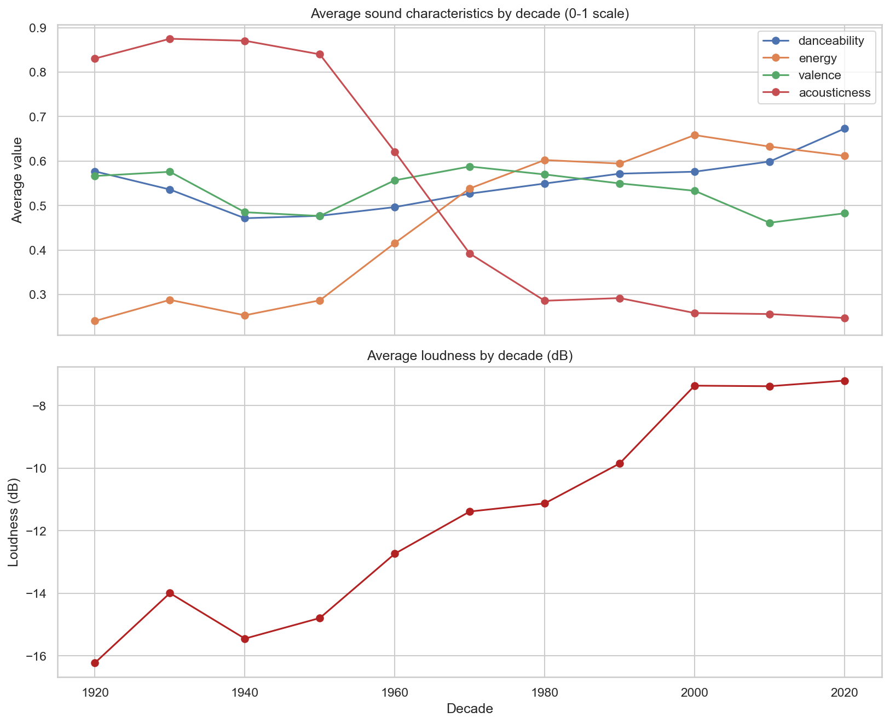
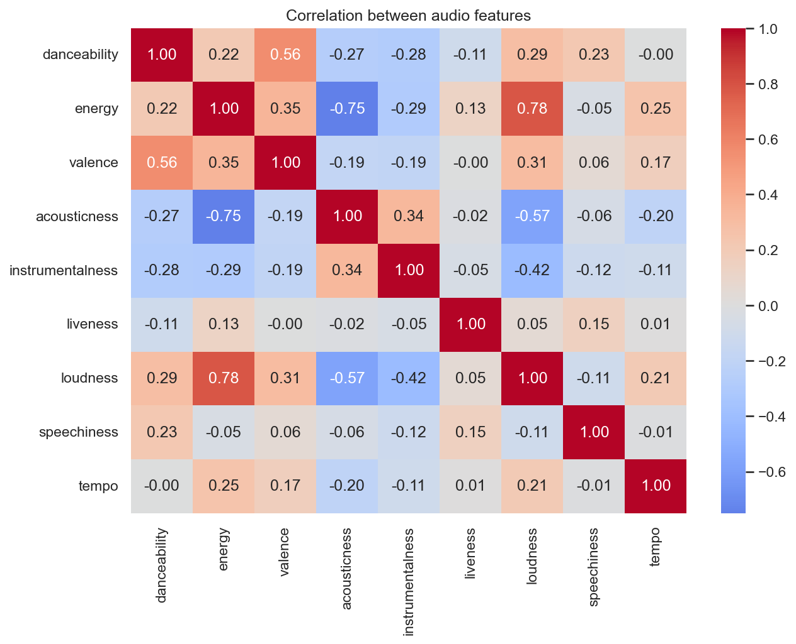
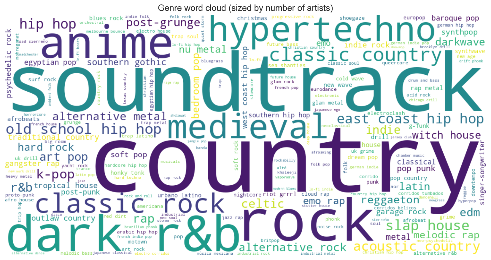
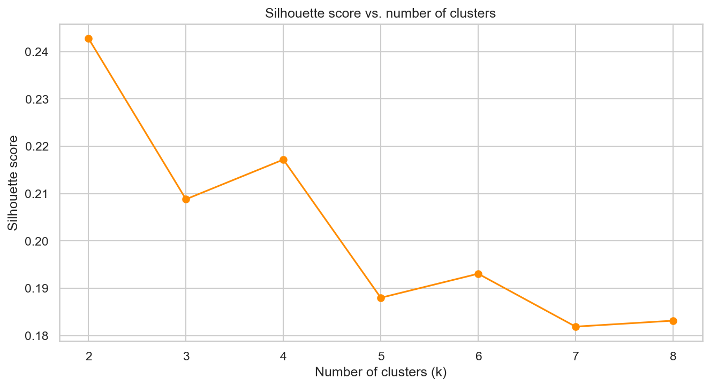
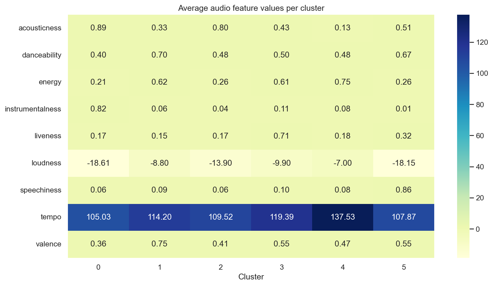
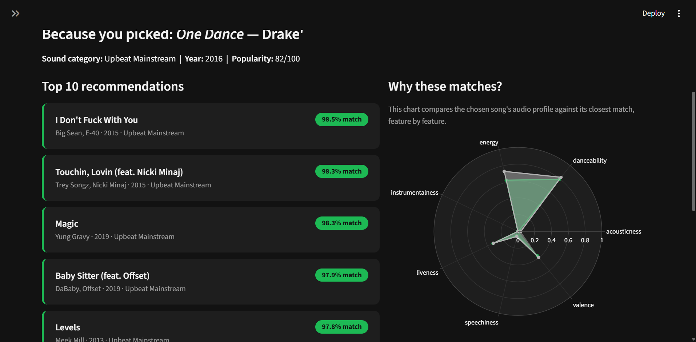

# Recommending Songs by Sound: A Content-Based Spotify Recommender

Oyenusi Oluwatobi

## Introduction and motivation

Music streaming platforms host tens of millions of songs, and most listeners rely entirely on the platform's own proprietary recommendation engine to discover anything new. This project asks a narrower, more answerable question: **starting from nothing but a song's raw audio characteristics like its tempo, energy, mood, and so on. How far can you get toward a genuinely useful recommendation system, using only public data and standard machine learning techniques?**

The project uses a real dataset of roughly 170,000 Spotify tracks spanning 1921–2020, along with a supplementary dataset of genre and artist metadata reaching into 2025. Partway through, Spotify's public API access to audio features was independently confirmed to have been deprecated for new developer applications as of late 2024 which shaped a real decision in this project about how to source data responsibly rather than assume it would always be available.

This README walks through the full pipeline in the order it was actually built: reading and validating the data, exploring it, clustering it, building the recommender, and finally wrapping it in an interactive app. Every result shown below is real output from the notebooks in this repo, not illustrative or fabricated.

## Workflow

### Reading and validating the data

The project starts from two datasets, each serving a different purpose:

| Dataset | Coverage | Used for |
|---|---|---|
| Audio-features dataset | 169,909 tracks, 1921–2020 | Clustering and the recommendation engine |
| Genre & metadata dataset | 8,778 tracks, 2009–2025 | Genre and artist exploration |

The split exists because of a real constraint: Spotify's audio-features endpoint (danceability, energy, tempo, etc.) is no longer accessible to new developer apps, so no actively-updated dataset with that information exists post-2024. The older dataset still has full audio characteristics; the newer one fills in genre and artist context that the older one lacks. Both datasets were checked for authenticity (ID format validity, internal consistency of artist follower counts, plausible genre tagging) before being trusted. see [`notebooks/01_reading_data.ipynb`](notebooks/01_reading_data.ipynb) for the full validation process, including a small inconsistency in artist follower counts that turned out to be a *good* sign of real, multi-session-scraped data rather than a red flag.

Both datasets came back clean: no missing values in the audio-features dataset, no duplicate rows or track IDs in either, and internally consistent metadata.

### Exploratory data analysis

[`notebooks/02_eda.ipynb`](notebooks/02_eda.ipynb) covers three things: how recorded sound has changed over the past century, which genres and artists dominate the metadata, and whether popularity is predictable from sound alone.

**Loudness rose steadily and acousticness fell sharply across the 20th century** — a pattern consistent with well-documented industry shifts toward louder mastering and electronic production:



**Energy and loudness are strongly correlated**, which directly informed which features to treat carefully during clustering:



**Genre and artist prominence**, visualized as word clouds sized by artist count and follower count respectively:



Perhaps the most useful negative result: **no single audio feature strongly predicts a track's popularity**. Scatter plots of popularity against danceability, energy, and valence show no clear trend.  This suggests popularity is driven more by external factors (marketing, playlist placement, artist fame) than by how a song sounds on its own. This finding shaped expectations for the recommender: it optimizes for *sonic* similarity, not popularity.

### Clustering

[`notebooks/03_clustering.ipynb`](notebooks/03_clustering.ipynb) applies K-Means to the nine scaled audio features to see whether songs form natural groups without being told anything about genre.

The elbow and silhouette methods were used to choose the number of clusters.Honestly, neither produced a sharp, obvious answer. Silhouette scores peaked modestly around 0.21–0.24 rather than approaching values that would indicate tightly separated clusters:



This isn't a flaw in the method. it justs reflects that music genuinely exists on a continuum rather than snapping into discrete categories. **k = 6** was chosen as the point past the steepest part of the elbow curve, and the resulting clusters turned out to be musically interpretable despite the modest separation scores:



| Cluster | Label | Defining characteristic |
|---|---|---|
| 0 | Acoustic Instrumentals | High acousticness *and* high instrumentalness — largely non-vocal, non-electronic |
| 1 | Upbeat Mainstream | High danceability, energy, and valence — the classic "feel-good" pop profile |
| 2 | Mellow Vocal / Ballads | High acousticness, low instrumentalness — acoustic tracks *with* vocals |
| 3 | Live Recordings | Standout liveness score — picks up on audience/room ambience regardless of genre |
| 4 | High-Energy / Up-Tempo | Lowest acousticness, highest energy and tempo |
| 5 | Spoken Word | Speechiness of 0.86 vs. 0.06–0.10 everywhere else — poetry and audiobook-style recordings, not music in the traditional sense |

That last cluster was a genuine, unplanned discovery, a good reminder that inspecting your clusters directly, rather than trusting only the summary statistics, sometimes surfaces things a numeric summary alone wouldn't make obvious.

### Recommendation engine

[`notebooks/04_recommendation_engine.ipynb`](notebooks/04_recommendation_engine.ipynb) builds a content-based recommender: given a song, it calculates cosine similarity between that song's scaled audio-feature vector and every other track in the dataset, then returns the top matches.

```python
def recommend(df, X_scaled, song_name, artist_name=None, n=10):
    matches = df[df["name"].str.lower() == song_name.lower()]
    if artist_name:
        matches = matches[matches["artists"].str.lower().str.contains(artist_name.lower())]

    chosen = matches.sort_values("popularity", ascending=False).iloc[0]
    query_vector = X_scaled[chosen.name].reshape(1, -1)
    similarities = cosine_similarity(query_vector, X_scaled)[0]
    # ... exclude the query song's own duplicates, de-duplicate re-releases, return top n
```

Two real bugs surfaced during testing, not during planning. They were worth documenting because they're the kind of thing that only shows up once you actually run a system against messy real-world data:

1. **Duplicate song titles across different artists** (e.g. "Home" matches 40 different songs), I fixed this by disambiguating by artist name, not just title.
2. **The same recording appearing under multiple Spotify IDs** (reissues, compilations) initially caused the recommender to recommend a song *to itself*. This was also fixed by excluding every row matching the query song's name **and** artist, not just its one specific row.

With those fixed, here's what the recommender actually returns for two well-known songs:

**Bohemian Rhapsody — Queen**

| Song | Artist | Year | Similarity | Sound Category |
|---|---|---|---|---|
| Cuerpo Sin Alma | Riccardo Cocciante | 1974 | 99.0% | High-Energy / Up-Tempo |
| Bohemian Rhapsody - 2011 Mix | Queen | 1975 | 98.5% | High-Energy / Up-Tempo |
| All I Need Is You - Live | Hillsong UNITED | 2005 | 98.2% | High-Energy / Up-Tempo |
| Johnny 99 | Bruce Springsteen | 1982 | 98.0% | High-Energy / Up-Tempo |
| Tiny Dancer | Elton John | 1990 | 97.9% | High-Energy / Up-Tempo |

**Shape of You — Ed Sheeran**

| Song | Artist | Year | Similarity | Sound Category |
|---|---|---|---|---|
| Que Te Vaya Bien | Grupo Jalado | 2017 | 98.9% | Upbeat Mainstream |
| Gripa Colombiana | Los Tucanes De Tijuana | 2000 | 98.9% | Upbeat Mainstream |
| Tu Defecto | Los Creadorez Del Pasito Duranguense | 2009 | 98.5% | Upbeat Mainstream |
| Hasta El Día De Hoy | Los Dareyes De La Sierra | 2008 | 98.4% | Upbeat Mainstream |
| Lupe Campos | El Fantasma, Los Dos Carnales | 2019 | 98.4% | Upbeat Mainstream |

These two results tell different stories. Bohemian Rhapsody's matches feel musically sensible — theatrical, mid-tempo rock and pop. Shape of You's matches are dominated by regional Mexican/banda-style tracks, which share tempo and danceability numbers but are a completely different genre and cultural context. See [Notes on the modeling approach](#notes-on-the-modeling-approach) below for why this happens and what it implies.

### Interactive app

The recommender is wrapped in a Streamlit app ([`app/streamlit_app.py`](app/streamlit_app.py)) styled around Spotify's own dark-and-green visual identity, since the project is explicitly grounded in Spotify data. A user searches for a song, picks the right match from a dropdown (disambiguating by artist and year), and gets the top 10 recommendations displayed as cards, alongside a radar chart comparing the chosen song's audio profile to its closest match and a breakdown of which sound categories the recommendations fall into.

Run it locally with:

```bash
streamlit run app/streamlit_app.py
```




## Notes on the modeling approach

A natural question is why this project uses simple cosine similarity over hand-picked audio features rather than a more sophisticated embedding-based or collaborative-filtering approach. The answer is mostly about what data was actually available: this project has no user-listening or playlist co-occurrence data, only track-level audio characteristics. Given that constraint, a **content-based** approach was the honest choice. It makes no claims about what real listeners actually group together, only about which songs *sound* alike by a fixed set of numeric measures.

This is also exactly why the One Dance result above matters. Cosine similarity over `danceability`, `energy`, `tempo`, etc. has no concept of genre, language, or cultural context — it will happily group songs that share a danceable tempo and upbeat mood even if a human listener would never put them in the same playlist. A collaborative-filtering approach, trained on real co-occurrence in user playlists, would likely correct exactly this kind of mismatch — because it learns from *how people actually group songs*, not just how the songs measure numerically.

`StandardScaler` was used before clustering and similarity calculations because the nine audio features live on very different scales (`tempo` spans roughly 0–250; most others span 0–1) — without scaling, `tempo` would dominate every distance calculation by sheer magnitude, not because it's actually more musically important.

## Conclusions

- A real, validated dataset of ~170,000 tracks was enough to build a working, interpretable recommendation pipeline end to end, with no synthetic data required.
- Unsupervised clustering on audio features alone recovered musically sensible groupings — including an unplanned discovery of a spoken-word cluster driven entirely by a speechiness outlier.
- Content-based recommendation works well when the query song's genre is common and well-represented (Bohemian Rhapsody), and reveals its core limitation when the query song's genre is narrower or more cross-cultural (Shape of You) — numeric audio similarity is not the same thing as genre or cultural similarity.
- Two real engineering bugs (duplicate titles, duplicate recordings under different IDs) were only found by testing against real data, not by reasoning about the code in the abstract — a good example of why testing against messy real-world data matters more than testing against clean toy examples.

## Limitations and further scope

- **No collaborative signal.** Every user gets identical recommendations for the same input song, since there's no listening-history data to personalize against.
- **No genre-awareness.** As shown above, this is the recommender's clearest weakness. Incorporating the genre tags from the metadata dataset as an explicit feature (or blending in a genre-similarity score) is a natural next step.
- **Data recency.** The audio-features dataset stops at 2020, since Spotify's public API no longer exposes this information for new applications. If access is restored or an alternative source becomes available, refreshing the dataset would be straightforward given the existing pipeline.
- **No live deployment.** The app currently runs locally; deploying it (e.g. via Streamlit Community Cloud) would make it accessible without a local Python environment.

## About

Built as a personal portfolio project to demonstrate a complete, honest data science workflow: data validation, exploratory analysis, unsupervised learning, and a deployed recommendation system — using real, verified data throughout and documenting real limitations rather than hiding them.

**Tech stack:** Python, pandas, scikit-learn, matplotlib/seaborn, Streamlit, Plotly

**Project structure:**

```
spotify_recsys/
├── notebooks/
│   ├── 01_reading_data.ipynb
│   ├── 02_eda.ipynb
│   ├── 03_clustering.ipynb
│   └── 04_recommendation_engine.ipynb
├── app/
│   └── streamlit_app.py
├── src/
│   ├── get_data.py
│   ├── data_loader.py
│   └── recommender.py
├── data/            (raw data fetched via src/get_data.py)
├── outputs/
│   ├── figures/     (all charts shown above)
│   └── models/      (saved scaler and K-Means model)
└── requirements.txt
```

See [Setup](#setup) below to run this yourself.

## Setup

```bash
git clone <your-repo-url>
cd spotify_recsys
pip install -r requirements.txt
python src/get_data.py
```

Run the notebooks in order (01 → 04) to reproduce the full pipeline, then launch the app:

```bash
streamlit run app/streamlit_app.py
```
